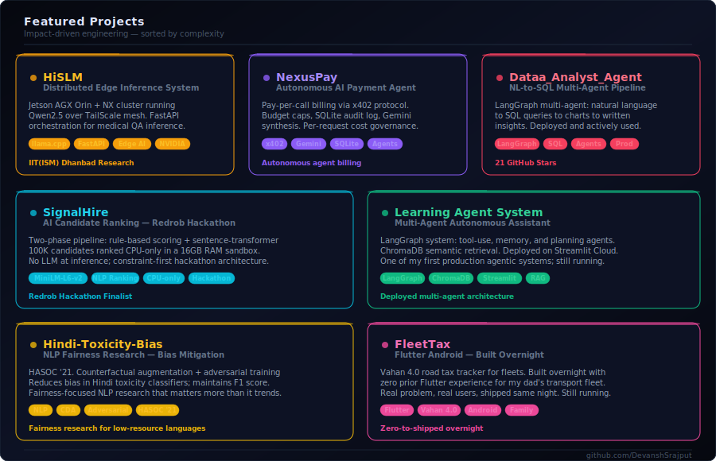
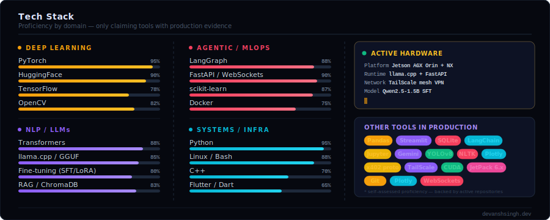

<div align="center">

<!-- HERO BANNER -->


<!-- TYPING TAGLINE -->
[](https://git.io/typing-svg)

<br/>

<!-- PROFILE BADGES -->

&nbsp;

&nbsp;

&nbsp;


</div>

---

<!-- ABOUT — rendered as code block for terminal aesthetic -->
```python
class DevanshSRajput:
    """
    Pre-final year CS @ SRM-IST (2027)  ·  Research Intern @ IIT(ISM) Dhanbad
    Distributed SLM inference on NVIDIA Jetson. Agentic AI. Edge computing.
    Built a Flutter app overnight with zero Flutter experience because a real
    problem needed solving. That's the vibe for everything here.
    """
    advisor   = "Prof. Dr. Amogth Tarachand — IIT(ISM) Dhanbad"
    current   = "HiSLM: hierarchical distributed inference across Jetson AGX Orin + Orin NX"
    stack     = ["Python", "PyTorch", "LangGraph", "llama.cpp", "FastAPI", "Flutter", "C++"]
    open_to   = ["Analytics roles", "Data Science", "ML Engineering", "Research collabs"]
    links     = {"portfolio": "devanshsingh.dev", "github": "DevanshSrajput"}

    def shipping_right_now(self):
        return "HiSLM paper — deadline June 25. Loss: decreasing."
```

---

<!-- ANIMATED SECTION DIVIDER -->
<div align="center">

</div>

<!-- PROJECTS -->
<div align="center">

## `> ls ./projects --top`



</div>

---

<!-- TECH STACK -->
<div align="center">

## `> cat ./stack.conf`



</div>

---

<!-- GITHUB STATS -->
<div align="center">

## `> cat ./stats.log`


<br/>

[](https://git.io/streak-stats)

</div>

---

<!-- CONTRIBUTION SNAKE -->
<div align="center">

## `> git log --graph`

<!-- 
  To enable the snake animation:
  1. Go to repo Settings → Actions → General → enable Actions
  2. Create .github/workflows/snake.yml with the generate-snake-game action
  3. It auto-generates the SVG on a schedule
  Reference: https://github.com/Platane/snk
-->


</div>

---

<!-- CONNECT -->
<div align="center">

## `> ./connect.sh`

[](https://devanshsingh.dev)
&nbsp;
[](https://github.com/DevanshSrajput)
&nbsp;
[](https://linkedin.com/in/DevanshSrajput)
&nbsp;
[](mailto:your@email.com)

<br/>

<!-- ANIMATED BOTTOM BAR -->


```
[████████████████████████░░░] HiSLM training in progress · loss: decreasing · deadline: June 25
```

*Running models on Jetson hardware from a hostel room. This is fine.*

</div>
